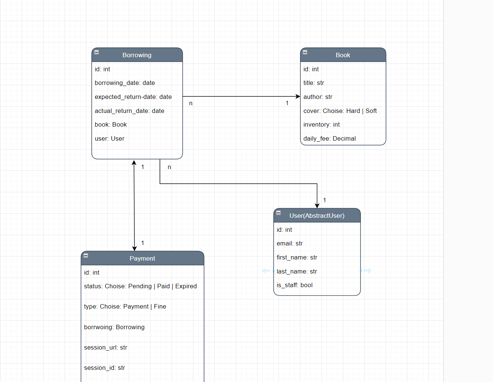
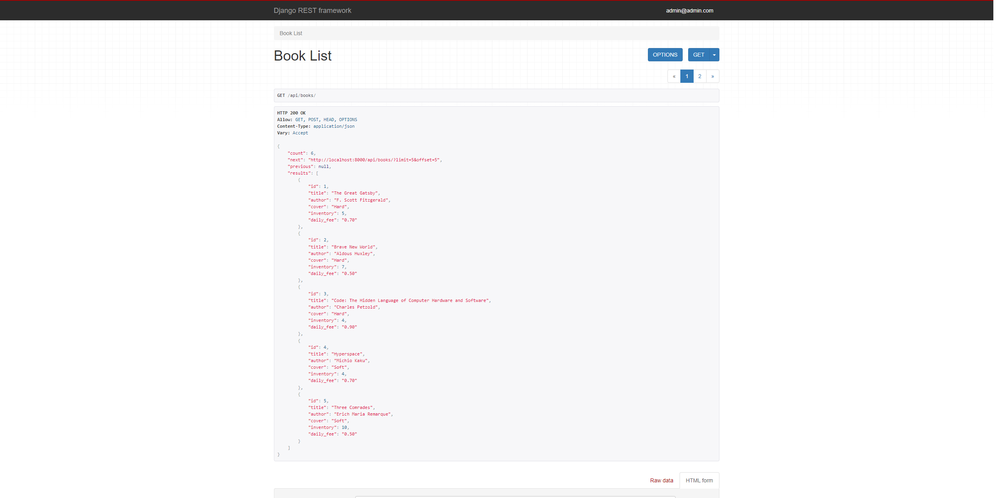
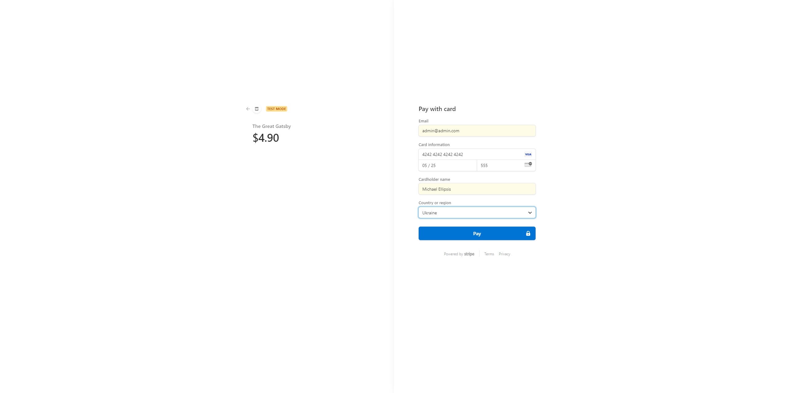

# Library Service

### About project:

This project is a library management system built using Django and Django REST Framework (DRF).
It allows users to borrow and return books, process online payments through Stripe, and receive Telegram notifications
from a library bot, keeping admin users informed about each borrowing and payment.

### Technologies that were included to this project:

1. **Django REST Framework**: For managing API views.
2. **PostgreSQL**: As the main database.
3. **Stripe**: An online payment system used to process transactions securely.
4. **Telegram bot** Keeps admin users informed about each borrowing and payment through a Telegram chat.
3. **Celery**: Used for checking if a payment session has expired and for monitoring overdue borrowings.
4. **Redis**: As the Celery broker.
5. **Docker Compose**: For developing the microservices.
6. **Swagger**: For API documentation.

### Library Service Features

* JWT authentication.
* Admin panel /admin/.
* CRUD functionality for books(for library staff).
* Create borrowings from users.
* Return borrowings.
* Create payment for each borrowing.
* Check borrowings for overdue.
* Fine system for overdue borrowings.
* Check payment for expiration.
* Renew payment session if it's expired.
* Postpone payment for 24 hours.
* Telegram notifications for library staff 

### How to run:

#### Using Docker

- Copy .env.sample -> .env and fill with all required data
- `docker-compose up --build`
- 
- Create admin user (Optional)
- `docker-compose exec -ti library_api python manage.py createsuperuser`

#### Using GitHub

```bash
git clone https://github.com/mwellick/library-api-service.git
cd library-api-service/library_service
python -m venv venv
source venv/bin/activate
pip install -r requirements.txt

# Apply migrations and run the server
python manage.py migrate
python manage.py runserver
```

### Test admin user:

**email:** `admin@admin.com`  
**password:** `Ellipsis`

### Test default user:

**email**: `qwe@qwerty.com`  
**password**: `Qwerty123`

## DB Structure


## Screenshots






## Copyright
Copyright (c) 2024 Michael Korotia
